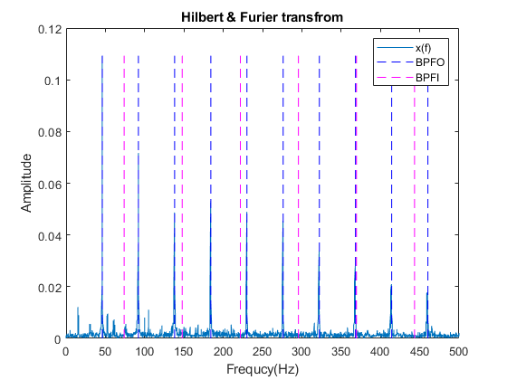

# 简单的滚动轴承故障诊断
---
**摘要**: 用传统的轴承故障诊断方法对轴承的振动信号进行分析诊断，得出其故障类型、健康状态。只是一个简单的学习、诊断QAQ。  
**数据集**: [paderborn](https://mb.uni-paderborn.de/en/kat/main-research/datacenter/bearing-datacenter)   
**方法**: 希尔伯特(Hilbert)包络解调。MATLAB.   
**目录**：
- [引言](#引言)
- [采集装置](#采集装置)  
- [包络解调](#包络解调)  
- [诊断分析](#诊断分析)  

---

## 引言
- 据统计，有40%到70%的机械系统故障和电机故障是由轴承损伤引起的，而轴承是机械设备中重要零件，轴承故障会中止系统的运行，对系统、设备造成损伤，造成维修、时间成本的大大提高。因此对机械系统运行时轴承进行诊断，通过对其轴承运行时的一些信息如振动信号进行采集，分析，可以得到其健康状况，提前预知其未来状态，在其发生损伤从而损害系统前，做出对应措施，可以有效较低成本。  

- 目前主要的轴承诊断方法是通过安装额外的加速度传感器采集轴承运行径向上的加速度即振动信息，使用这些振动数据对轴承进行诊断。但采用这种方法，成本较高，多用于大型工业应用。对于采集到的振动数据，进行如时域、频域分析、深度学习方法进行分析。*以下将使用频域分析诊断轴承*。

## 采集装置
- **简介**: 试验数据来自德国Paderborn轴承试验数据集。其试验装置是由电动机、扭矩测量轴、滚动轴承测试模块、飞轮和负载电机组成的模块化系统，电动机作为传感器。
	- 轴承测试模块可安装不同试验轴承。试验台将采集在不同的工况下电动机电流信号以及轴承外壳的振动信号再现故障轴承的运行状况。
	- 主要操作参数: 驱动系统的转速、测试轴承上的径向力和传动系中的负载扭矩。
	- 试验设置: 在试验中，对于每一个轴承，都有4组相同试验设置，三个主要操作参数有一组固定水平作为基本设置，作为一组实验；另外在固定水平的基础上改变其中一个参数，得到另外3组实验。测量过程中各操作参数保持不变，而温度则在整个试验过程中也保持在一定范围内。  
<div align=center> </div>
<div align=center>试验装置台(1-电动机、2-扭矩测量轴、3-滚动轴承测试模块、4-飞轮、5-负载电机)</div>  

- **试验轴承**:
装置可安装到轴承测试模块的轴承型号：6203、N203、NU203，试验采用的轴承类型均为6203。  

	- 6203参数:
	<div align=center> </div>
	
	|参数|数值|
	|---|---|
	|内径	|17mm|
	|外径	|40mm|
	|宽度	|12mm|
	|节圆直径	|29.05mm|
	|滚动体直径	|6.75mm|
	|滚子数量	|8个|
	|推力角	|0°|  

	

- **试验设置**：

	|试验设置|转速(rpm)|加载扭矩(Nm)|径向力(N)|温度(℃)|名称代号|
	|---|---|---|---|---|---|
	|0|1500|0.7|1000|45~50|N15_M07_F10|
	|1|900|0.7|1000|45~50|N09_M07_F10|
	|2|1500|0.1|1000|45~50|N15_M01_F10|
	|3|1500|0.7|400|45~50|N15_M07_F04|

- **数据采集**:
	- 试验中采集的主要数据为电动机的定子电流和轴承测试模块采集的轴承表面加速度即轴承的振动信息，这些测量同步进行。除了以上数据，试验过程中，还需记录其他附加参数：轴承径向力、扭矩测量轴上的负载扭矩、转速以及轴承模块中油温。
	对应每一种不同的轴承实验设置，将测量20次，每次测量4s。下面将从单次测量说明数据参数：  

    |传感器|数据长度|采样时间|滤波器频率|采样频率|
    |---|---|---|---|---|
    |压电加速度计|256k|4s|30kHz|64kHz|
    |电动机|256k|4s|25kHz|64kHz|  
    
    - [具体代号见论文](https://mb.uni-paderborn.de/fileadmin/kat/PDF/Veroeffentlichungen/20160703_PHME16_CM_bearing.pdf)

    
- **故障特征频率**：  

    - 外圈固定(fixed)，内圈自由
    
    |故障特征|计算公式|
    |---|---|
    |外圈故障|$`f_{BPFO} = 0.5zf(1-{d\over D}cos\alpha)`$ |
    |内圈故障|$`f_{BPFI} = 0.5zf(1+{d\over D}cos\alpha)`$ |
    |滚动体故障|$`f_{BSF} = 0.5{D\over d}f(1-({d\over D})^2cos^2\alpha)`$ |
    |保持架故障|$`f_{FTF} = 0.5f(1-({d\over D})cos\alpha)`$ |    
    
    (z为滚动体个数，f为转动频率，α为轴承接触角，d为滚动体直径，D为滚道节径)
    

## 包络解调
- 故障所引起的低频（通常是数百HZ以内）冲击脉冲激起了高频（数十倍于冲击频率）共振波形，对它进行包络、检波、低通滤波（即解调），会获得一个对应于低频冲击的而又放大并展宽的共振解调波形。  
- 当存在局部故障的轴承运行时，将会在运行中产生冲击脉冲，进而激起轴承的高频固有振动，这种高频固有振动将成为轴承的载波，并且受到故障引起的调制，故通过对轴承的振动信号，进行解调，可以在调制波谱中得到轴承出现的故障特征频率，从而用其诊断轴承的故障类型。  
- 对轴承振动信号进行包络解调，能够检测到很弱的冲击故障信号，因此可以比较容易的发现轴承的故障特征频率。其方法、实现过程为：先对原始数据进行Hilbert变换，再通过对经Hilbert变换后的数据取模得到包络线，再对其进行傅里叶变换，得到包络谱图，可以较为清晰地发现是否有故障特征频率的存在，从而对轴承的故障情况进行诊断。

## 诊断分析
- [原始数据下载](https://mb.uni-paderborn.de/en/kat/main-research/datacenter/bearing-datacenter/data-sets-and-download)   

- **分析数据选择代号**: K001、KA01、KA03。  
  数据结构(K001.mat): `struct {Info,X,Y,Description}`
  其中，Y:传感器采集到的7种不同数据，如温度、转速、力矩，振动数据为最后一组数据 Y(end).Data
  <div align=center></div>
  
- **原始数据以及傅里叶变换**   
  - 原始数据:
  （`N09_M07_F10_KA01_2.mat`）  
  <div align=center> </div>
    
  - 简单分析：可以看到数据比较干净；从傅里叶频谱图，可以看到有间隔为46的变频带。  

   
- 包络解调分析  
  - 用平均转速的转频作为参考，算出特征频率，在包络谱中绘制得到如下图：
    <div align=center></div>  
    
    左：可以看到，基本46Hz即外圈故障的特征频率出现，因此，该轴承为外圈故障特征；而右则为内圈故障。  
    ```matlab []
        % Hilbert and fft 对原始信号进行Hilbert包络 并且进行傅里叶变换
        h_x = hilbert(data); %Hilbert
        h_x = abs(h_x);    %取绝对值
        h_x = h_x - mean(h_x);  %减去均值
        %进行傅里叶变换
        H_X = abs(fft(h_x)/L);  
        H_X = H_X(1:int32(L/2+1));
        H_X(2:end-1) = 2*H_X(2:end-1);
    ```   
    - [代码见](./matlab_script/)  
    - [Hilbert求包络](https://blog.csdn.net/anddisking/article/details/102224111?utm_medium=distribute.pc_relevant.none-task-blog-title-2&spm=1001.2101.3001.4242)  
    
    <div align=center></div>   
        内外圈均故障轴承。

---
## Reference:
[1] [Paderborn,PDF](https://mb.uni-paderborn.de/fileadmin/kat/PDF/Veroeffentlichungen/20160703_PHME16_CM_bearing.pdf)  

